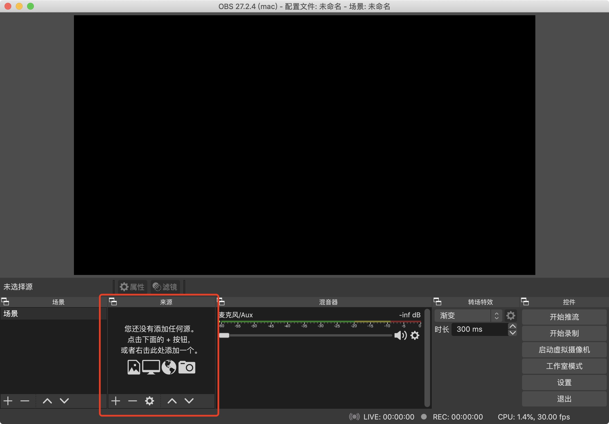
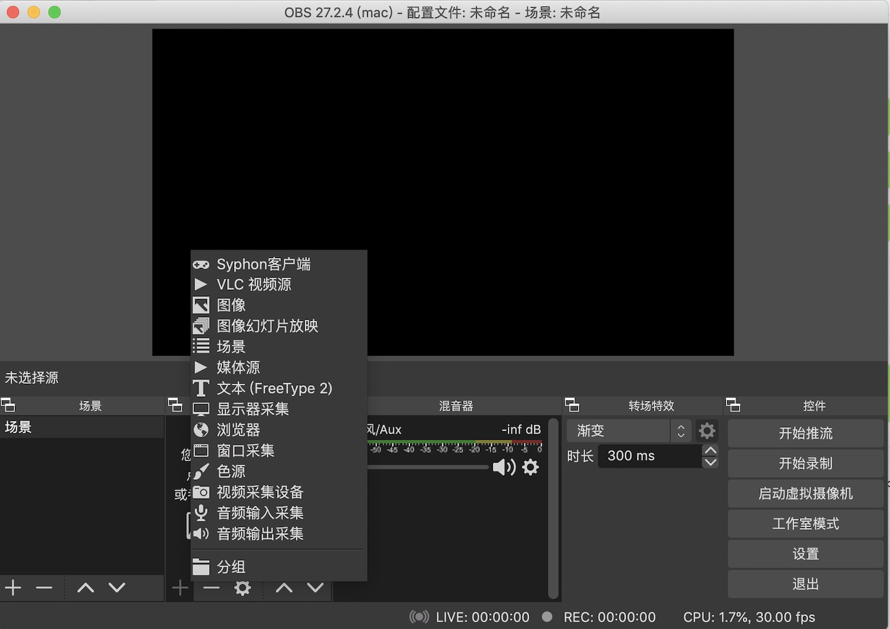
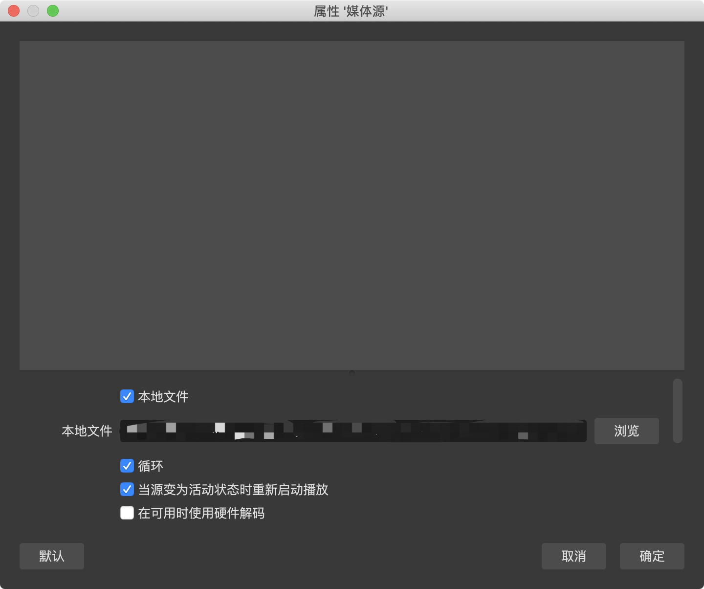
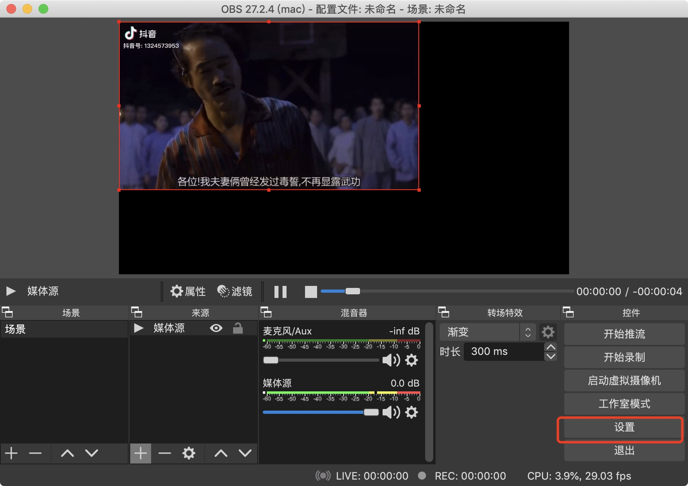
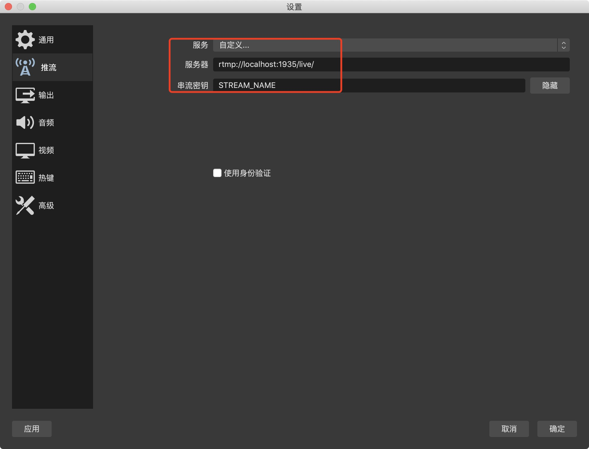
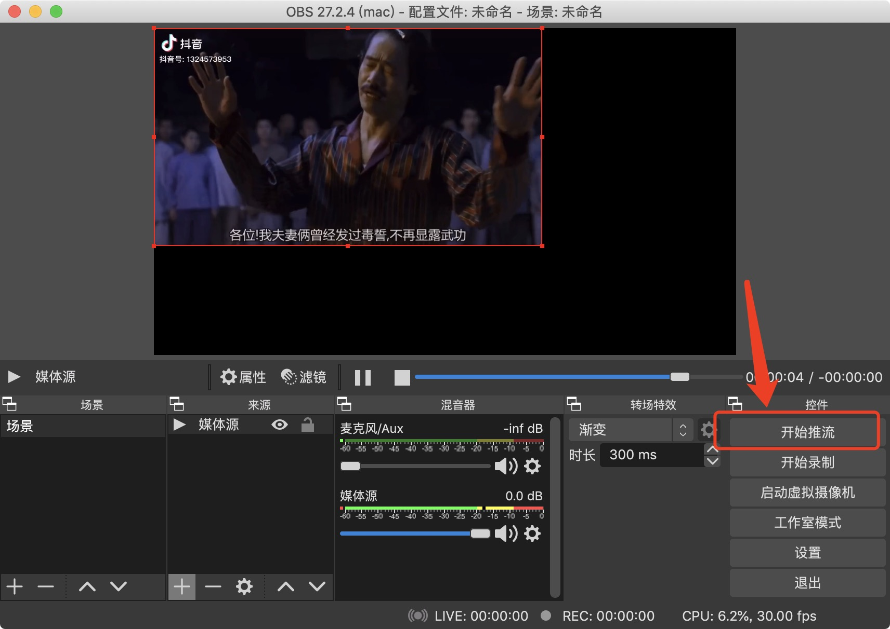
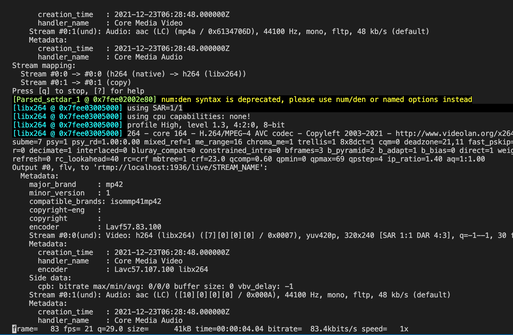
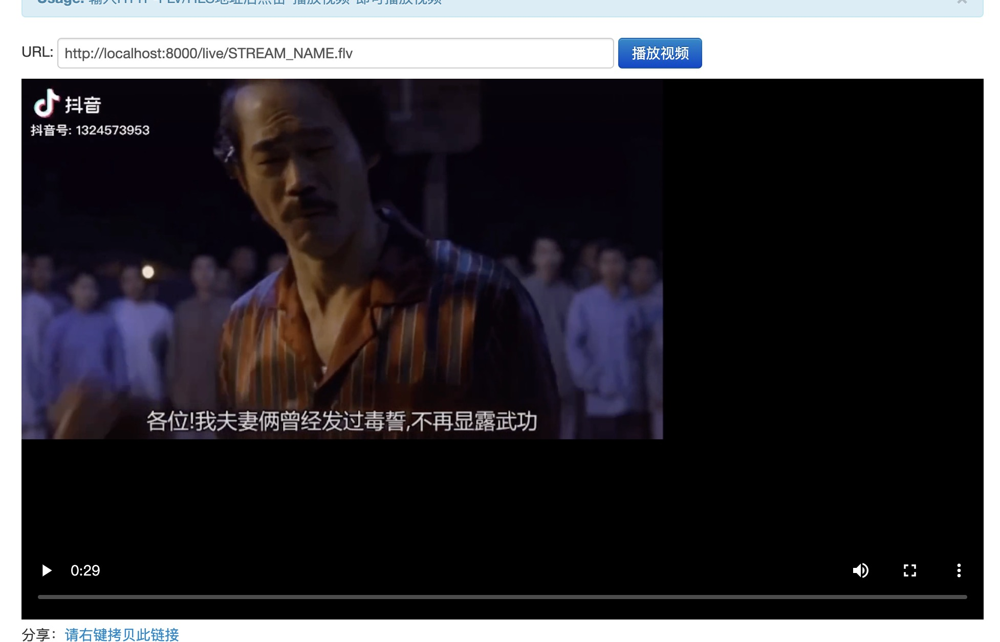

# 本地搭建简易直播推拉流环境

之前参与过视频监控和直播相关的开发，试过搭建简单的直播推拉流环境，这里做一下分享。

一个视频直播流程大概如下（[图片来源](https://juejin.cn/post/6844904179836813325)）：


1. 视频采集推流，数据源可以是手机拍摄、摄像头拍摄、视频文件，然后利用 `obs、FFmpeg` 工具推流。
2. 流媒体服务器，接收采集端视频推流和播放端拉流。
3. 播放端，拉取视频流到当前客户端播放。

以下分别讲解这三端的搭建。

## 流媒体服务器

首先我们需要搭建一个流媒体服务器，接收播放端的推流。

开源的流媒体服务器，比较出名的有这几种。

- [nginx-rtmp-module](https://github.com/arut/nginx-rtmp-module)
- [node-media-server](https://github.com/illuspas/Node-Media-Server)
- [lal](https://github.com/q191201771/lal)
- [livego](https://github.com/gwuhaolin/livego)

这里为了方便操作，选用的是 `node-media-server`，其他几个都比较麻烦，需要 `go` 环境和编译，特别是 `nginx-rtmp-module`，装起来特别麻烦。

根据官方文档提示，直接运行如下命令即可完成安装运行：

```bash
npx node-media-server

# 或者
npm i node-media-server -g
node-media-server
```

超级简单。这样我们就完成了一个流媒体服务器的搭建了，它的地址是：

```
rtmp://localhost:1935/live/STREAM_NAME
```

到时我们推流的时候会用到它。

## 推流端

推流工具出名的有 [OBS](https://obsproject.com/zh-cn/download) 和 [FFmpeg](http://ffmpeg.org/download.html)。

其中 `OBS` 可视化界面，一般用这个就够了。`FFmpeg` 的功能比较强大，如果要求定制化强度比较高的，可以用这个，下面都分别讲解下。

### OBS 推流

在官网下载安装好 [OBS](https://obsproject.com/zh-cn/download) 之后，就可以直接使用了。

#### 添加视频源

在下方“来源”，点击“➕”，添加一个视频源，可以是本地视频文件，也可以是摄像头，都可以：



可以选择你希望的视频源，“媒体源”是本地文件，“视频采集器”是摄像头：



我这里以本地文件作示例，选择文件后，勾选“循环”方便测试：



点击“设置” --> “推流”，修改我们的推流地址，



服务选择“自定义”，然后输入我们的流媒体服务器地址。

服务器：`rtmp://localhost:1935/live/`
`串流密钥：STREAM_NAME`



然后点击“开始推流”：



这样我们成功推流了。

### FFmpeg

除了上面的 `OBS`，也可以用 [FFmpeg](http://ffmpeg.org/download.html) 进行推流。同时也可以安装 [ffplay](https://ffmpeg.org/ffplay.html) 测试本地播放是否成功。

根据官网提示安装完了之后，我们要选择视频文件做推流测试，推流命令如下：

```bash
ffmpeg -re -stream_loop -1 -i ./video.mp4  -c:a copy -c:v libx264 -f flv rtmp://localhost:1936/live/STREAM_NAME
```

这里对上述的一下命令参数做一下解释：

```
ffmpeg                                  命令
-re                                     以原生帧速率读取输入。这相当于设置 -readrate 1
-stream_loop -1                         设置输入流应循环的次数。0 是无循环，-1 是无限循环
-i ./video.mp4                          设置输入文件的url
-c:a copy                               原音频是什么编码，推流的就是上面编码
-c:v libx264                            设置推流视频编码为 h264
-f flv                                  强制推流封装格式为 flv
rtmp://localhost:1936/live/STREAM_NAME  流媒体服务器地址
```

执行上述命令后，出现如下界面，即推流成功：



## 播放端

播放端可以自己用 `flvjs` 写一个直播播放器，如果有 `ffplay`，可以执行如下命令测试：

```bash
ffplay http://localhost:8000/live/STREAM_NAME.flv
```

或者使用在线视频直播测试，如[这个](http://ossrs.net/players/srs_player.html)，成功后显示如下：



经过上面的操作，一个简单的本地直播推拉流环境搭建就完成了。

后面分享一些关于本地 `H265` 视频编码推流的测试。

### H265 本地推流测试

`H265 (HEVC)` 编码的视频的传输大小要比 `H264` 小很多，可以省很多的带宽。

但是 `OBS` 并不支持 `H265` 编码的传输，官方的 `FFmpeg` 也不支持，但经过自行改造之后可以支持。

默认的 `FFmpeg` 的编码 `CodecID` 没有 `H265`，但是金山云在 `FFmpeg` 的源码基础上增加了 `rtmp h265` 的支持，添加了 `CodecID = 12`：

```
enum {
    FLV_CODECID_H263    = 2,
    FLV_CODECID_SCREEN  = 3,
    FLV_CODECID_VP6     = 4,
    FLV_CODECID_VP6A    = 5,
    FLV_CODECID_SCREEN2 = 6,
    FLV_CODECID_H264    = 7,
    FLV_CODECID_REALH263= 8,
    FLV_CODECID_MPEG4   = 9,
    FLV_CODECID_HEVC    = 12, <-----
};
```

然后对其源码进行了改动，完成了 `H265` 的支持，可以到[金山云的 Github](https://github.com/ksvc/FFmpeg) 下载安装，或者也可以试试[这个](https://github.com/numberwolf/FFmpeg-QuQi-H265-FLV-RTMP
)。

如果是 `MAC / Linux` 电脑，可以参考 [这篇文章](https://www.pengrl.com/p/20044/) 或者 [How-to-compile-cn 这篇文章](https://github.com/runner365/srt_encoder/wiki/How-to-compile-cn) 安装。

安装过程中会遇到很多坑，下面这些我遇到的：

```
1. 报错：Package "openssl", required by "srt", not found
解决：
export PKG_CONFIG_PATH="/usr/local/lib/pkgconfig:/usr/local/opt/openssl/lib/pkgconfig"
或者
export PKG_CONFIG_PATH="/usr/local/lib/pkgconfig:/usr/local/Cellar/openssl@3/3.0.1/lib/pkgconfig"

2. 报错：【Link】ld: unknown option: -soname” on MacOS X
解决：
https://blog.csdn.net/SoaringLee_fighting/article/details/78334173
soname -> install_name

https://github.com/Haivision/srt/issues/1382
SRTO_SMOOTHER -> SRTO_CONGESTION
SRTO_STRICTENC -> SRTO_ENFORCEDENCRYPTION
SRTO_TSBPDDELAY -> SRTO_LATENCY
```

希望大家不会遇到。。。

如果编译成功，在 `FFmpeg` 的根目录下会生成很多产物，其中就包括了 `ffmpeg、ffplay` 的二进制执行文件，这样就可以进行 `H265` 推流了。

同时我把我这边打包好的  `ffmpeg、ffplay` 上传到这边文章所在的目录，可以试试在你们的电脑能不能用~

如果要接收 `H265` 编码的视频推流，需要支持 `H265` 的流媒体服务器，我这里用的是 [lal](https://github.com/q191201771/lal)，安装好 `go` 环境，按照提示编译好 `lalserver` 就可以用了。

首先在 `lal` 目录下启动 `lalserver`：
```bash
./bin/lalserver -c conf/lalserver.conf.json
```

然后在金山云 `ffmpeg` 目录下利用生成的 `ffmpeg` 推流：
```bash
./ffmpeg -re -stream_loop -1 -i ./video-h265.mp4 -c:a copy -c:v libx265 -f flv rtmp://127.0.0.1:1935/live/test110
```

然后在金山云 `ffmpeg` 目录下利用生成的 `ffplay` 测试播放：
```bash
./ffplay rtmp://127.0.0.1:1935/live/test110
```

这样就在本地测试 `H265` 的直播推拉流了。