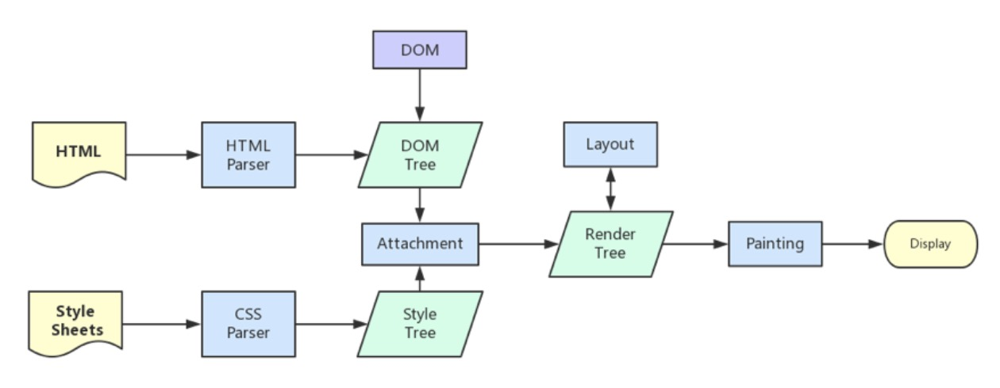
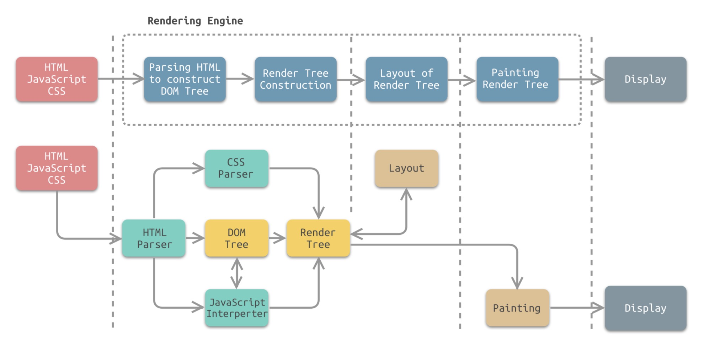

# 记录一个关于 Chrome 浏览器渲染阻塞的问题

## 问题
有下面一段 `html` 代码，在浏览器中打开，它是怎么样的呈现结果呢？

```html
<!DOCTYPE html>
<html lang="en">
  <head>
    <meta charset="UTF-8" />
    <meta http-equiv="X-UA-Compatible" content="IE=edge" />
    <meta name="viewport" content="width=device-width, initial-scale=1.0" />
    <title>Document</title>
  </head>
  <body>
    <h1 id="a">第一行</h1>
    <script>
      var start = Date.now();
      while (Date.now() - start < 3 * 1000) {}
    </script>
    <h1>第二行</h1>
    <script>
      var start = Date.now();
      while (Date.now() - start < 3 * 1000) {}
    </script>
    <style>
      #a {
        color: red;
      }
    </style>
    <h1>第三行</h1>
    <script>
      var start = Date.now();
      while (Date.now() - start < 3 * 1000) {}
    </script>
    <h1>第四行</h1>

    <style>
      #a {
        visibility: hidden;
      }
    </style>
    <script>
      var start = Date.now();
      while (Date.now() - start < 3 * 1000) {}
    </script>
    <h1>第五行</h1>
  </body>
</html>
```

## 渲染原理
要了解它如果运行，首先我们需要先了解浏览器的渲染过程，借用一张很经典的图：



简略版渲染机制一般分为以下几个步骤：

1. 处理 `HTML` 并构建 `DOM` 树。
2. 处理 `CSS` 构建 `CSSOM` 树。
3. 将 `DOM` 与 `CSSOM` 合并成一个渲染树。
4. 根据渲染树来布局，计算每个节点的位置。
5. 调用 `GPU` 绘制，合成图层，显示在屏幕上。

[来源](https://github.com/daydaylee1227/Blog/issues/10)

由上面流程可知，`DOM` 树和 `CSSOM` 树的构建是同时进行的，不会相互阻塞，但是渲染树要等两者都完成构建了，才会被合成，所以 `DOM` 树和 `CSSOM` 树阻塞渲染树的合成。

所以，正常的流程是，`DOM` 树和 `CSSOM` 树构建好了，等渲染树的合成之后，经过布局计算、绘制合成之后，才会显示在屏幕上。

上面的代码有 `JavaScript` 脚本执行的过程，这个过程上面的图没有很有的体现出来，我们换一张图看：



[来源](https://hondrytravis.com/docs/performance/browser_rendering_process/)

上图中，`HTML Parser` 会解析标签，构建 `DOM Tree`，遇到 `CSS style` 标签或者 `style` 属性，就会交给 `CSS Parser` 处理，遇到 `JavaScript` 脚本，就会先执行 `JavaScript` 脚本，再继续构建 `DOM Tree`，最后合成 `Render Tree`，经过 `Layout`、`Painting` 之后就渲染展示，大体流程跟我们第一张图是类似的。

这里再提一下 `GUI` 线程和 `JavaScript` 引擎线程。

浏览器渲染进程中，有 `GUI` 线程和 `JavaScript` 引擎线程， 

- `GUI` 线程：解析`HTML`、`CSS`，构建 `DOM` 树和 `CSSOM` 树，合成 `RenderObject` 树，布局、绘制、重绘和回流
- `JavaScript` 引擎线程：责解析 `Javascript` 脚本，运行代码

在 `JavaScript` 执行过程中，可能操作修改 `DOM`，为了避免渲染出现不可预期的结果，保证数据一致性，两个线程总是互斥的，即 `UI` 渲染会阻塞 `JavaScript` 执行， `JavaScript` 执行也会阻塞 `UI` 渲染。

## 预期中渲染的结果
有了上面的理论知识，我们大致可以知道我们一开始给出的代码段是如何运行的了。

1. 浏览器 `GUI` 线程从 `html` 标签开始解析构建 `DOM Tree`，一直往下解析 `head、meta、title、body、h1`
2. 遇到 `script` 脚本， GUI 线程被挂起，`JavaScript` 引擎线程执行脚本，运行 `3` 秒，阻塞 `DOM` 树构建
3. `JavaScript` 引擎线程被挂起，`GUI` 线程继续构建 `DOM Tree`，解析到 `h2` 标签
4. 遇到 `script` 脚本， `GUI` 线程被挂起，`JavaScript` 引擎线程执行脚本，运行 `3` 秒，阻塞 `DOM` 树构建
5. `JavaScript` 引擎线程被挂起，`GUI` 线程继续构建 `DOM Tree`，遇到 `style` 标签，解析 `CSS`，同时继续解析到 `h3` 标签
6. 遇到 `script` 脚本， `GUI` 线程被挂起，`JavaScript` 引擎线程执行脚本，运行 `3` 秒，阻塞 `DOM` 树构建
7. `JavaScript` 引擎线程被挂起，`GUI` 线程继续构建 `DOM Tree`，解析到 `h4` 标签
8. 遇到 `script` 脚本， `GUI` 线程被挂起，`JavaScript` 引擎线程执行脚本，运行 `3` 秒，阻塞 `DOM` 树构建
9. `JavaScript` 引擎线程被挂起，`GUI` 线程继续构建 `DOM Tree`，解析到 `h5` 标签
10. 构建完 `DOM Tree` 和 `CSSOM Tree` 之后合成 `Render Tree`，经过 `Layout`、`Painting` 之后就在屏幕渲染一次性展示出来

所以最终结果是，屏幕白屏了大概 `12` 秒，然后屏幕同时显示红色字体第一行、第二行、第三行、第四行、第五行。

## 渲染不符合预期

要是就是上面这个结果，文章就结束了，然而并不是。

在实验中，我用 `Chrome` 打开上面代码，它是边解析边渲染的，它是这样显示的：

1. 页面首先显示文字 “第一行”
2. `3` 秒后页面追加显示文字 “第二行”
3. `3` 秒后 “第一行”文字变为红色，同时页面追加显示文字 “第三行”
4. `3` 秒后页面追加显示文字 “第四行” 和 “第五行”

按照之前的理论，不是解析 `HTML` 代码，构建 `DOM` 树和 `CSSOM` 树，合成 `RenderObject` 树，然后布局绘制再渲染展示么？这里面有一个阻塞过程对的，不应该分开展示，为什么会这样呢？

这里是一个很奇怪的事情。经过我实验，只有 `Chrome` 是这样，大部分浏览器，如 `Safari、IE、Firefox` 都是最后一次性渲染出来。

这让我一度以为是 `Chrome` 做的优化，然后并没有找到相关文献的描述。

既然没有找到这个优化的描述，让我觉得这是 `Chrome` 的一个 `Bug`......

然后我就试着换浏览器版本测试这个结果，最后发现，
- 在 `Chrome 96` 及以前，它是不完成被阻塞，分开渲染的
- 在 `Chrome 97` 及以后，它像 `Safari、IE、Firefox` 一样，都是最后一次性渲染的，符合预期

这样我更困惑了，我试图在它的 [Chrome 97 更新日志](https://developer.chrome.com/blog/new-in-chrome-97/)里面找到相关描述，然而并没有。

在网络也找到有其他朋友遇到类似的问题，但都没有解决：
- [render-blocking-javascript-at-end-of-body-tag-inline-vs-external-script](https://stackoverflow.com/questions/59471566/render-blocking-javascript-at-end-of-body-tag-inline-vs-external-script)
- [浏览器渲染——html页面外联script会阻塞页面渲染吗？](https://www.cnblogs.com/FHC1994/p/13162696.html)

经过一番折腾，没有找到问题原因，朋友们要是有兴趣，可以到它 [change list](https://chromium.googlesource.com/chromium/src/+log/96.0.4664.50..97.0.4692.71) 里面找找，看看有没有相关的变更描述，变更太多了，我还没找到。

朋友们也可以换着浏览器自己试一下：[https://fulldo.github.io/render](https://fulldo.github.io/pages/render)

或者下载不同的 `Chromium` 浏览器测试：
- [Chromium 96](https://commondatastorage.googleapis.com/chromium-browser-snapshots/index.html?prefix=Mac/920553/)
- [Chromium 97](https://commondatastorage.googleapis.com/chromium-browser-snapshots/index.html?prefix=Mac/930007/)

## 总结

对于一开始给出的代码，
- `Chrome 96` 及以前的版本，它是边解析边渲染在屏幕显示
- `Chrome 97` 及以后，`Safari、IE、Firefox` 等浏览器，都是最终一次性在屏幕显示，符合浏览器渲染原理

要是有朋友知道 `Chrome 96` 及以前的版本分开渲染的原因和相关文章依据，可以告诉我一起探讨下哦~