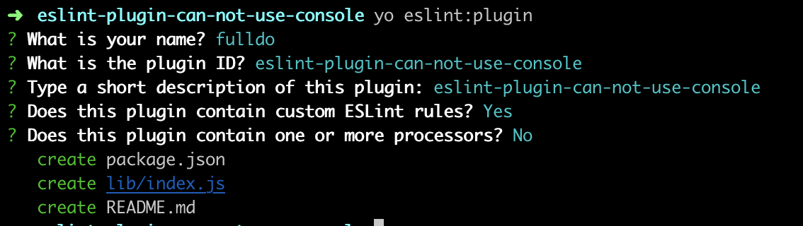
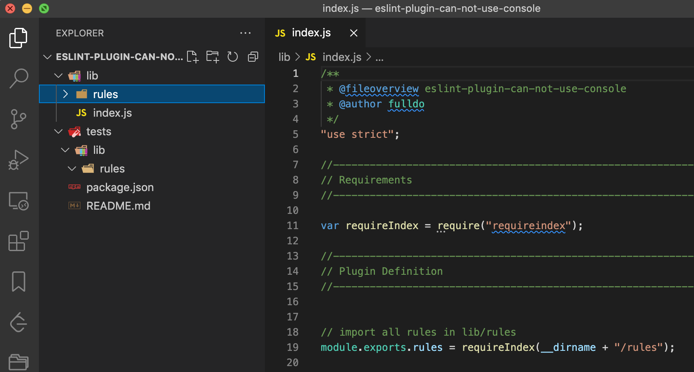
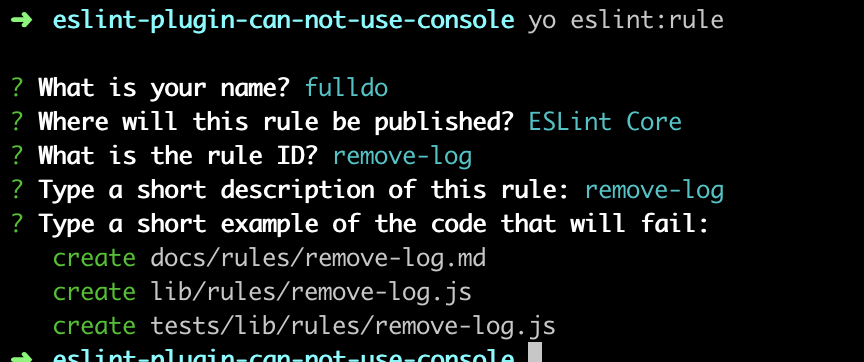
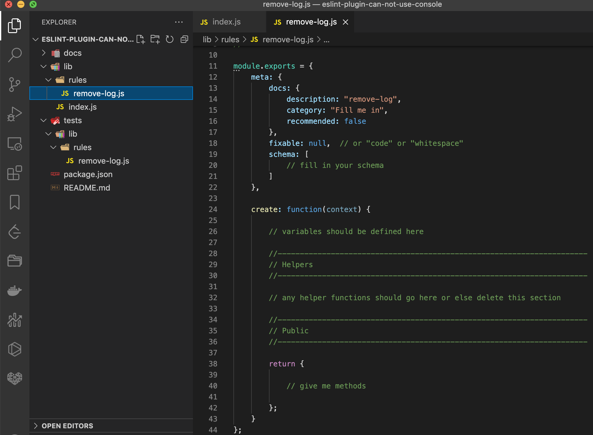
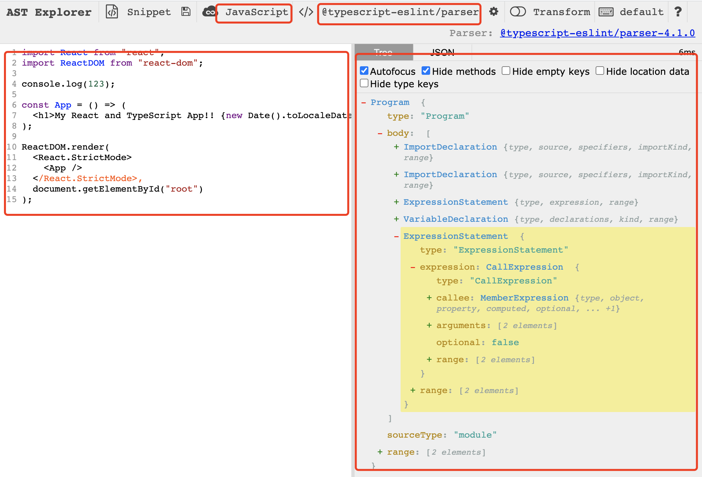
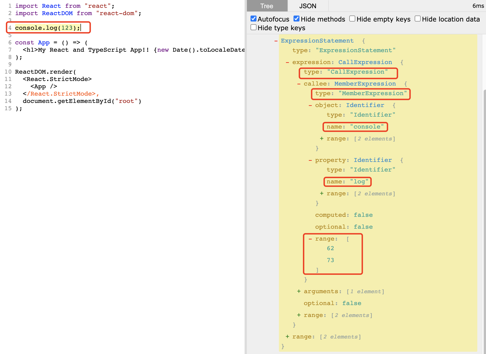
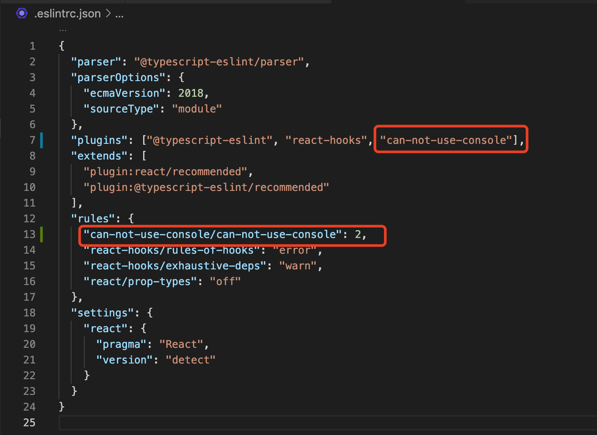
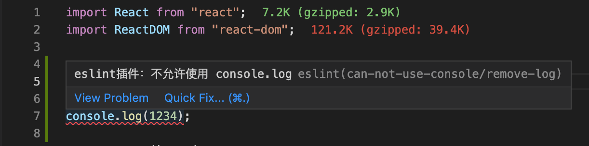
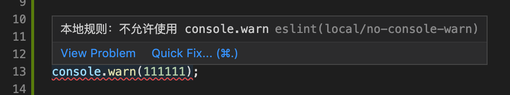
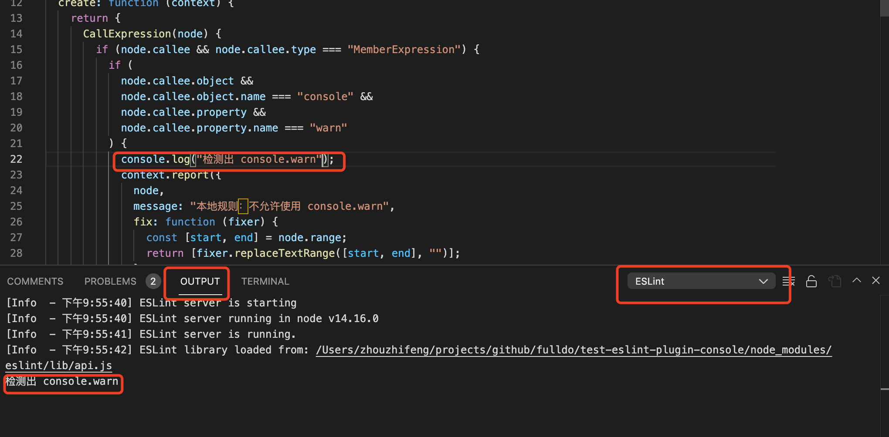

# eslint 插件的编写

本文介绍 eslint 插件的编写和 eslint Nodejs API 的运行。

本文的例子都在如下 git 仓库：

- eslint 插件：[https://github.com/fulldo/eslint-plugin-can-not-use-console](https://github.com/fulldo/eslint-plugin-can-not-use-console)
- 测试项目：[https://github.com/fulldo/test-eslint-plugin-console](https://github.com/fulldo/test-eslint-plugin-console)

## 创建 eslint 项目

根据[官方教程](https://eslint.org/docs/developer-guide/working-with-plugins)，利用 [Yeoman generator](https://www.npmjs.com/package/generator-eslint) 生成 eslint 插件项目模板，eslint 插件项目目测都是以 eslint-plugin 开头的。

注意：本文用的版本是：nodejs v12.9.1，yo v4.0.0

```bash
npm i -g yo

npm i -g generator-eslint
```

安装完成之后，就可以创建 eslint plugin 项目了：

```bash
mkdir eslint-plugin-can-not-use-console

cd eslint-plugin-can-not-use-console

yo eslint:plugin
```

可以按照提示输入信息创建：



然后会自动生成如下项目文件：



此时我们已经创建好 eslint plugin 项目了，然后就可以创建自定义的 eslint rules 了，执行如下命令：

```bash
yo eslint:rule
```

可以按照提示输入信息创建：



然后会自动生成如下规则文件：



此时我们把 eslint plugin 项目已经搭建完成了。

## 编写 rule 代码

这里以清除 console.log 为例，简单描述 eslint 插件规则怎么写。

假设我们有以下一段代码：

```js
import React from "react";
import ReactDOM from "react-dom";

console.log(123);

const App = () => (
  <h1>My React and TypeScript App!! {new Date().toLocaleDateString()}</h1>
);

ReactDOM.render(
  <React.StrictMode>
    <App />
  </React.StrictMode>,
  document.getElementById("root")
);
```

我们想在编写代码的过程中，通过 eslint 自动把 console.log(123) 移除应该怎么做呢？

首先我们要识别需要处理的语法代码块的 AST 节点，可以通过 [AST Explorer](https://astexplorer.net/) 来识别。

选择 Javascript 语法和 @typescript-eslint/parser 解析器，然后将代码复制到左侧输入框，在右侧就能看到其解析后的 AST 了。



然后我们利用鼠标选择 console.log(123) ，获得 type、callee、name、range 的关键信息：



根据这个关键信息，然后回到之前创建的 eslint 插件项目的 remove-log.js 文件上，可以这样写来识别改语法并处理：

```js
module.exports = {
  meta: {
    docs: {
      description: "remove-log",
      category: "Fill me in",
      recommended: false,
    },
    fixable: "code", // 这里设置 fixable 的值为 "code"
    schema: [
      // fill in your schema
    ],
  },

  create: function (context) {
    return {
      // 对 AST 节点类型为 CallExpression 的做处理
      CallExpression(node) {
        // 对 node.callee 类型为 MemberExpression 的做处理
        if (node.callee && node.callee.type === "MemberExpression") {
          // 识别节点为 console.log
          if (
            node.callee.object &&
            node.callee.object.name === "console" &&
            node.callee.property &&
            node.callee.property.name === "log"
          ) {
            // 匹配到 console.log 语句
            // 通过 context 对象上报错误，即在该代码块下提示红线改错误
            context.report({
              node,
              // 提示的错误信息
              message: "eslint插件：不允许使用 console.log",
              // 对该错误的修复函数，这里以移除 console.log 语句为例
              fix: function (fixer) {
                // 取得 console.log 语句的位置
                const [start, end] = node.range;
                // 通过调用 fixer 对象的 replaceTextRange 函数，将改语句替换为空字符串
                return [fixer.replaceTextRange([start, end], "")];
              },
            });
          }
        }
      },
    };
  },
};
```

这里 rule 模块导出的有 meta 和 create 两个属性。具体文档可以看[这里](https://eslint.org/docs/developer-guide/working-with-rules)。

meta 定义了这个插件的基本信息，其中它的 fixable 属性要设置为 code 。

create 是一个函数，它需要返回一个对象。返回的对象定义了 ESLint 在遍历代码的 AST 时调用访问特定节点的函数。函数的名称一般都是节点类型（node type），如 CallExpression、MemberExpression、ImportDeclaration、Identifier、VariableDeclaration 等，我们这里例子要处理的是 CallExpression 类型。我们在判断到是 console.log 调用语法时，就通过 context.report 上报该错误，然后可以设置 fix 函数，对该节点进行处理，我们这里通过 fix 函数的 fixer 参数，调用其 replaceTextRange 函数，将 console.log 替换为空字符串。

至此，一个简单的 eslint 插件就开发完成了。

## 发布 & 测试

我们可以把这个包发布到 [npm](https://www.npmjs.com/) 。

如果没有 npm 账号，需要先[注册](https://www.npmjs.com/signup)，然后在插件目录下，跑以下命令就可以发布了：

```bash
npm login

npm publish
```

然后在项目中安装该包

```bash
npm install eslint-plugin-can-not-use-console --save-dev
# 或者
yarn add eslint-plugin-can-not-use-console -D
```

在类似于 .eslintrc 的配置文件加上该插件和此规则：

```js
{
  "plugins": ["can-not-use-console"],
  "rules": {
    "can-not-use-console/remove-log": 2
  }
}
```

如图示：



然后我们就能看到项目中的 console.log 会报错了：



如果你的安装了 vscode eslint 插件，并且设置了保存代码自动修复，那么保存时，该 console.log 语句就会自动去掉。

如果没有安装该插件，运行 eslint 的命令也行看到效果：

```bash
yarn eslint --fix src/index.tsx
```

## 不发包写 eslint 规则

每次写 eslint 插件都需要发布，比较麻烦，如果我们想在本地项目代码就能方便测试，可以通过 [eslint-plugin-local](https://www.npmjs.com/package/eslint-plugin-local) 插件，安装：

```bash
npm i eslint-plugin-local --save-dev
# 或者
yarn add eslint-plugin-local -D
```

然后先项目的目录添加 .eslintplugin 目录，在里面创建 index.js 和 rules 目录。

这里通过清除 console.warn 语法介绍这个插件怎么用。

首先在 rules 目录下创建 no-console-warn.js，代码如下：

```js
module.exports = {
  meta: {
    docs: {
      description: "remove-warn",
      category: "Fill me in",
      recommended: false,
    },
    fixable: "code",
    schema: [],
  },

  create: function (context) {
    return {
      CallExpression(node) {
        if (node.callee && node.callee.type === "MemberExpression") {
          if (
            node.callee.object &&
            node.callee.object.name === "console" &&
            node.callee.property &&
            node.callee.property.name === "warn"
          ) {
            context.report({
              node,
              message: "本地规则：不允许使用 console.warn",
              fix: function (fixer) {
                const [start, end] = node.range;
                return [fixer.replaceTextRange([start, end], "")];
              },
            });
          }
        }
      },
    };
  },
};
```

然后在 .eslintplugin/index.js 导出这个规则：

```js
exports.rules = {
  "no-console-warn": require("./rules/no-console-warn.js"),
};
```

最后在 .eslintrc 引入该规则：

```js
{
  "plugins": ["local"],
  "rules": {
    "local/no-console-warn": 2
  }
}
```

配置完成之后，我们重启 vscode ，最后看到 console.warn 也会检测出来报错了：



另外讲下两个调试方法，

1. 在本地 vscode 调试看结果时，每次更改都需要重新加载窗口

   mac 的快捷按键是 command + P ，然后输入 >reload。

2. 直接通过命令运行调试，看输出结果，种方式调试改代码不需要重新加载 vscode 窗口

```bash
yarn eslint src/index.tsx
```

这

3. 如果安装了 vscode eslint 插件，可以通过 OUTPUT 面板，选择 ESLINT 模块看输出结果

   

到这里，相信大家已经掌握 eslint 插件的开发啦！

## nodejs Api 使用 eslint

有时候我们的代码是自动生成的，我们希望通过代码的形式使用 eslint 格式化我们的代码，就需要 eslint 提供的 nodejs Api 去解决了，具体文档看[这里](https://eslint.bootcss.com/docs/developer-guide/nodejs-api)，如果你的 eslint v7 以下的，看[这里](https://eslint.bootcss.com/docs/developer-guide/nodejs-api)。

下面我介绍下 eslint v6 和 eslint v7 两种不同使用 nodejs api 的方法。

这里用 nodejs 清除未使用 import 的场景讲解两种写法。

首先安装一个[插件](https://www.npmjs.com/package/eslint-plugin-unused-imports)：

```bash
npm i eslint-plugin-unused-imports --save-dev
# 或者
yarn add eslint-plugin-unused-imports -D
```

假设我们有这样的代码，其中 useState 是没有使用的 import ：

```js

```

### 最新版 eslint nodejs Api 的使用

```js
const { ESLint } = require("eslint");

async function main() {
  // 1. Create an instance with the `fix` option.
  const eslint = new ESLint({
    fix: true,
    baseConfig: {
      parserOptions: {
        ecmaVersion: 2018,
        sourceType: "module",
      },
      plugins: ["unused-imports"],
      rules: { "unused-imports/no-unused-imports-ts": "error" },
      settings: {
        react: {
          version: "999.999.999",
        },
      },
    },
  });

  // 2. Lint files. This doesn't modify target files.
  const results = await eslint.lintFiles([`src/un-use-test/un-use-test.tsx`]);

  // 3. Modify the files with the fixed code.
  await ESLint.outputFixes(results);
}

main().catch((error) => {
  process.exitCode = 1;
  console.error(error);
});
```

按照这个模板，即可运行，更多详细 Api 可自行查阅文档。

在 demo 项目运行如下命令，即可看到结果

```bash
node ./remove-for-latest-eslint.js
```

### eslint v6 nodejs Api 的使用

```js
const eslint = require("eslint");

const cli = new eslint.CLIEngine({
  parser: "@typescript-eslint/parser",
  baseConfig: {
    parserOptions: {
      ecmaVersion: 2018,
      sourceType: "module",
    },
    plugins: ["unused-imports"],
    rules: { "unused-imports/no-unused-imports-ts": "error" },
    settings: {
      react: {
        version: "999.999.999",
      },
    },
  },
  fix: true,
});
const report = cli.executeOnFiles([`src/un-use-test/un-use-test.tsx`]);

eslint.CLIEngine.outputFixes(report);
```

CLIEngine 即将被废弃，但现在仍然保留，所以这种方法在新版不建议使用的哈。

按照这个模板，即可运行，更多详细 Api 可自行查阅文档。

在 demo 项目运行如下命令，即可看到结果

```bash
node ./remove-for-eslint-v6.js
```
