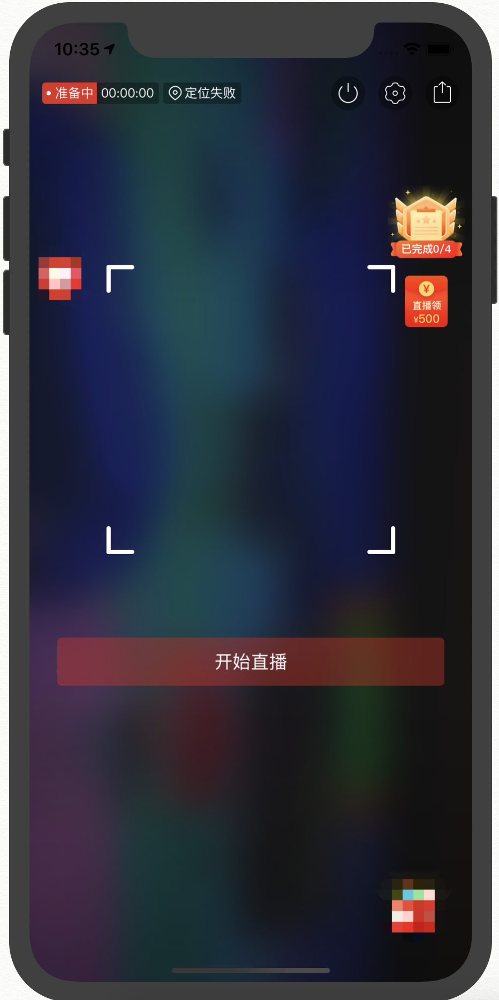
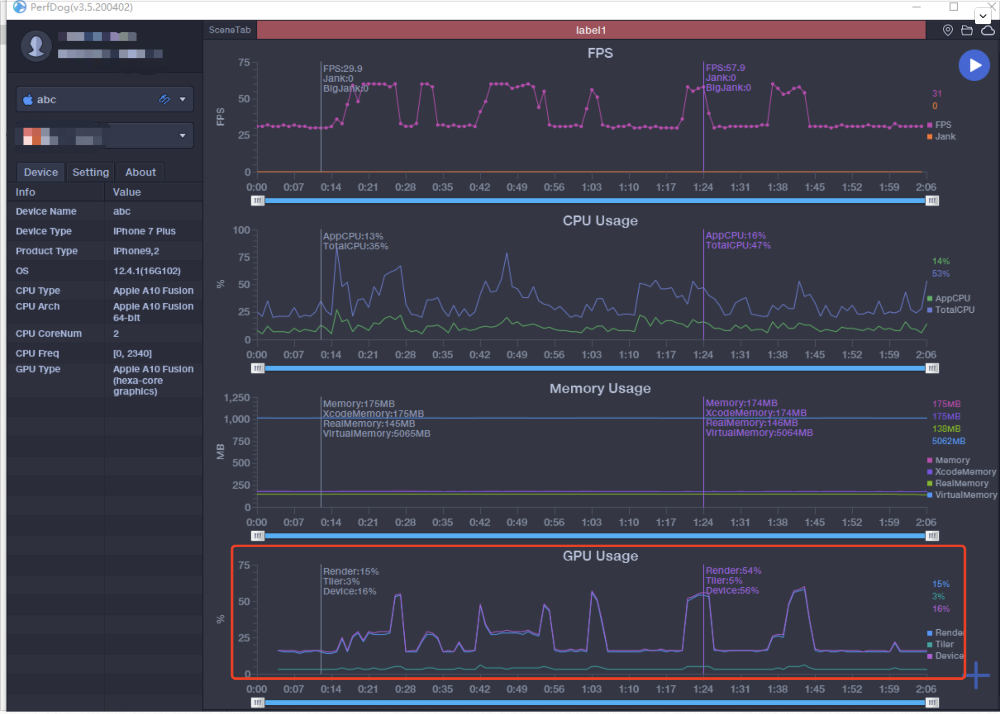
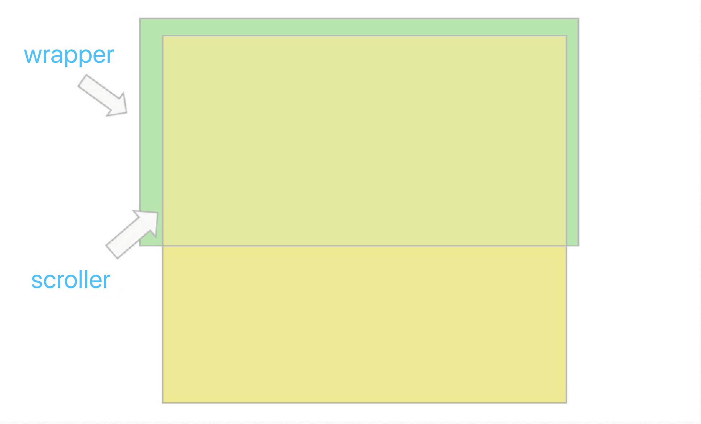
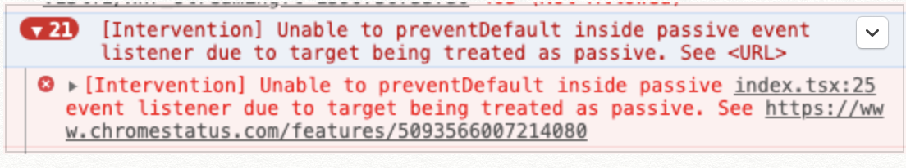

# 优化直播间 H5 挂件页滚动卡顿问题踩坑 IScroll

## 背景

在做直播的时候，会有一些挂件业务，是 `H5` 做的，如下图右上侧两个挂件：



点击挂件可以打开 `Popup`（一个 `Webview` 打开的页面）展示一些活动信息，如果超出 `Popup` 的高度是可以滚动的：


在测试过程中或者上线之后，测试和产品都有反馈过这些弹窗内容在滚动的时候都有可能出现滚动的情况，而我们自己测试却又一直不能重现，后面测试小姐姐当面重现，并提供一张由 `PrefDog` 测试的性能图：



在性能图最下方的 `GPU Usage`，每一个高峰都是在测试滚动时卡顿了 `GPU` 突然飙升形成的。

然后再非直播间打开挂件，测试滚动，并不会造成卡顿和 `GPU` 高峰。

跟客户端反馈情况，请教是什么原因造成的。经过了解，可能原因是，直播期间和美颜瘦脸很占用 `GPU` 资源，此时 `GPU` 可能资源不足，滚动时 `Webview` 渲染也会占用 `GPU` 资源，所以就会导致卡顿。这样情况在低端机型性能不足时容易复现，高端机型如 `iPhone11+` 就不会出现这样的情况。

这样的情况客户端也能优化，但是客户端有版本限制，旧版本就没法处理了，所以自己 `H5` 这边开始着手优化了。

在直播间 `H5` 的滚动是 `Webview` 原生执行的滚动，由上面 `GPU` 性能图可以看出 `Webview` 执行滚动过程中是使用 `GPU` 去做计算的，而直播中的实时美颜瘦脸已经非常耗 `GPU` 性能了，此时 `GPU` 并不能支撑 `H5` 页面执行平滑的滚动，所以解决卡顿问题的一个方向是能不能不用 `GPU` 去计算滚动？

在业界中处理滚动比较出名的两个库就是 `better-scroll` 和 `iscroll` ，而 `better-scroll` 是受 `iscroll` 启发开发的，两者原理大体相同，都是通过手势触摸计算移动距离然后触发 `translate/top/left` 变化产生滚动效果，而这个过程是通过监听事件来实现的，执行的是 `js` 计算，即 `CPU` 计算，并不会调用 `GPU` 计算。`better-scroll` 和 `iscroll` 对比，`better-scroll` 的功能更丰富，考虑到 `iscroll` 更轻盈更适合移动 `H5` 的场景，决定选择踩坑 `iscroll`（最后感觉 `better-scroll` 有 `ts` 和中文文档而且一直有维护可能会更香些 🤣）

在使用过程中，大大小小踩不了坑，在这些坑中有学到了很多知识，特别是 `Pointer event、touch event` 和 `Chrome` 对滚动的优化。在本文中将分享踩的坑和学到的东西。

## iscroll 原理

`iscroll` 有 `wrapper` 和 `srcoller` 两个概念，其中 `wrapper` 包裹着 `scroller`，而要触发滚动，`scroller` 的高度必须大于 `wrapper。`



`iscroll` 按照 `pointer event & MSPointer event 、toçuch event 、mouse event`
的优先顺序，只有其中一类事件的构造函数存在，就监听这一类事件来触发滚动。在默认情况下，优先使用 `pointer event`，而且 `touch event`，最后 `mouse event`，当然也可以自己设置禁止使用允许使用哪一类事件。

`iscroll` 内部抽象出 3 个处理滚动的函数，分别是`_start、_move、_end`。以 `touch event` 为例
在生成一个 `iscroll` 实例的时候（`new IScroll`），如果能用 `touch event` `的情况下，iscroll` 会分别监听 `touchstart、touchmove、touchcancel` 和 `touchend` 事件（这两个事件处理相同），等事件被触发是，分别到 `_start、_move、_end` 去处理。
在 `_start` 函数中，会记录此时事件触发的位置 `pointX` 和 `pointY，`

```js
this.pointX = point.pageX;
this.pointY = point.pageY;
```

在 `_move` 的时候用当前事件的坐标减去 `pointX` 和 `pointY`，分别得到要滚动的距离 `deltaX` 和 `deltaY`，然后把 `pointX` 和 `pointY` 赋值为当前事件的坐标，方便计算下次 `move` 时的位置

```js
(deltaX = point.pageX - this.pointX),
  (deltaY = point.pageY - this.pointY),
  (this.pointX = point.pageX);
this.pointY = point.pageY;
```

然后在符合滚动条件的情况下(当前时间距离上次滚动结束时间大于 `300ms`，且触摸半径在方形 `10px` 内)，计算出本次滚动的最终位置，然后调用 `_translate` 函数触发滚动

```js
// this.x this.y是上次最终的位置
newX = this.x + deltaX;
newY = this.y + deltaY;

this._translate(newX, newY);
```

`_translate` 函数通过改变 `scroller` 的 `transform:translate` 值（默认）或 `top/left` 值，

```js
if (this.options.useTransform) {
  this.scrollerStyle[utils.style.transform] =
    "translate(" + x + "px," + y + "px)" + this.translateZ;
} else {
  x = Math.round(x);
  y = Math.round(y);
  this.scrollerStyle.left = x + "px";
  this.scrollerStyle.top = y + "px";
}
// 记录本次滚动的最终位置，以计算下次滚动的最终位置
this.x = x;
this.y = y;
```

## 初始化了 ISroll，但是去没法滚动

在一开始使用时候，我并不了解 `iscroll` 的原理，直接复制官网文档的代码使用，发现完全不能滚动，后面找到了官方 `demo`，发现是需要套两层容器，一层 `wrapper`，一层 `srcroll`，`wrapper` 容器需要设置 `overflow:hidden`，在局部滚动的情况，还需要给 `wrapper` 一个高度。

```js

<div ref={wrapperRef} className={styles.wrapper}>
     <div className={styles.scroller}>{children}</div>
</div>


.wrapper {
  position: absolute;
  top: 0;
  bottom: 0;
  left: 0;
  right: 0;
  width: 100%;
  overflow: hidden;
}

.scroller {
  position: absolute;
  z-index: 1;
  -webkit-tap-highlight-color: rgba(0, 0, 0, 0);
  width: 100%;
  transform: translateZ(0);
  user-select: none;
  text-size-adjust: none;
}

```

## Chrome 无法滚动

写完上述代码之后，还是发现无法滚动，经过查找，发现在 `chrome55+` 之后是无法直接使用的。

### 为什么在 Chrome55+会失效，是什么原因？

`Chrome55+` 支持了 `pointer event`，而 `iscroll` 内部如果判断 `window.PointEvent` 存在，就会优先使用 `pointer event`，在手势移动时触发 `pointermove` 事件，如果会一直能连续触发 `pointermove` 事件，那是没问题，但根据https://developer.mozilla.org/en-US/docs/Web/CSS/touch-actiond 的描述，当开始处理 `touch` 事件时，会触发 `pointercancel` 事件（An application using Pointer_events will receive a pointercancel event when the browser starts handling a touch gesture），这样就会打断 `pointermove` 事件（https://developer.mozilla.org/en-US/docs/Web/API/HTMLElement/pointermove_event）,导致 `iscroll` 不能正常使用。

### 如何解决 Chrome55+会失效问题？

参照问题原因，解决的思路有两个

思路 1： 不优先使用 `pointer event`

思路 2： 使用 `pointer event`，不触发 `pointercancel`

https://github.com/cubiq/iscroll/issues/1130#issuecomment-324517231 提供了三种方法去解决这个问题，逐一探究一下这 `3` 种办法为什么可以解决。

1、在 `isroll` 的 `wrapper` 添加 `css` 属性 `touch-action: none`
这个是思路 `2` 的做法，参照https://developer.mozilla.org/en-US/docs/Web/CSS/touch-action 这里的描述，如果 `touch-action` 为 `none`，将会禁用浏览器对所有 `touch` 平移和缩放手势的处理，不会处理 `touch` 事件不会触发 `pointercancel` 事件

2、在生成 `IScroll` 实例时，设置 `disablePointer` 为 `true`

```js
new IScroll("#wrapper", {
  disablePointer: true,
});
```

这个是思路 `1` 的做法，禁用 `pointer event`。

但在实践中，发现还是没法使用。在 `iscroll` 默认配置里面，

```js
disablePointer : !utils.hasPointer,
disableTouch : utils.hasPointer || !utils.hasTouch,
disableMouse : utils.hasPointer || utils.hasTouch,
```

`disableTouch` 和 `disableMouse` 在 `PointEvent` 构造函数存在时，默认为 `true`，而我们是 `h5` 页面，仅仅这样是无法解决的，所以添加 `disableTouch` 为 `false` 的配置。

3、在 `document` 上绑定 `touchmove` 事件，第三个参数设置 `passive` 为 `false`

```js
document.addEventListener(
  "touchmove",
  function (event) {
    event.preventDefault();
  },
  {
    passive: false,
  }
);
```

这是个思路 `2` 的做法，这个跟解决方案 `1` 类似，只是实现不同。这里在 `touchmove` 的回调函数里面通过 `preventDefault` 来禁用浏览器对移动手势的处理，这样便不会触发 `pointercancel` 事件。

刨根问底，这个 `passive: false` 是啥玩意呢，是不是一定要加呢？

这个是 `google chrome` 提供的一个滚动优化，在 `touch` 事件里添加了一个 `passive` 的配置，只要在 `window、body、document` 上绑定在 `touch` 事件，`passive` 就默认为 `true`，意思就是浏览器认为你不会在事件 handler 函数中调用  `preventDefault()`，可以安全地让页面滚动，不再等待事件 `handler` 函数执行完再滚动，具体可以看原文https://developers.google.com/web/updates/2017/01/scrolling-intervention，也可以看译文https://ljf0113.github.io/2017/07/09/making-touch-scrolling-fast-by-default-nbsp-nbsp-web-nbsp-nbsp-google-developers/。

所以如果在 `window、body、document` 绑定了 `touchstart、touchmove` 事件并且调用了 `event.preventDefault()`，但是又没有传 `passive` `参数，Chrome` 就会抛出一个错误：



## 优化前

滑动直播间为 `Webview`，能感觉出很明显的卡顿，无法滑动：


## 优化后

滑动很顺畅，不会出现卡顿：


