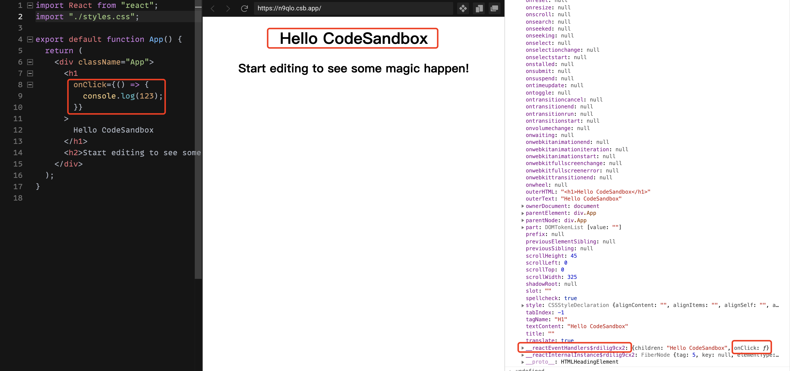

# 前端全埋点技术的实现

通过监控上报用户页面行为，然后对上报的数据进行统计分析，可以知道产品功能的使用情况。本文在 B 端应用的角度，讲述全埋点技术的实现。

## 埋点方式概况

通常前端埋点的方式有这几种：

1. 全埋点。前端对用户的行为如点击按钮、页面跳转等都做记录无差别上报。优点是能收集到大量数据，对用户的的行为都能上报；缺点是无法很好定制上报埋点数据和要求服务端有存储大量的数据的能力（可以通过采样上报解决，不过数据量还是很大）。
2. 手动埋点。即在代码中嵌入埋点逻辑。优点是能灵活埋点，定制性强；缺点是开发是需要编写埋点逻辑，与业务代码有耦合。
3. 圈选埋点。即通过页面可视化的形式，手动标识哪些区域需要上报，如 GrowingIO 、百度统计 、google 广告，都有提供这种方式的埋点 。优点是与代码解耦，更方便非开发同学埋点；缺点是严重依赖 `DOM` 结构， `DOM` 结构变化之后需要重新定义埋点。

在应用中，可以采用 3 种结合的方式互补优缺点，不过还是要看各应用方的实际情况选用。

这里探讨下全埋点技术的实现。

## 全埋点的实现

用户的行为有很多如页面访问（PV）、页面停留时长、页面元素可见、元素点击等，基于实际应用，这里对页面访问、页面停留时长、元素点击做了实现。

### 上报数据的结构

由于应用场景是多系统多项目，所以有些数据结构一样，如用户名用户 id，但有些不一样如系统名称项目名称，所以数据结构可能是这样：

```
用户名
用户id
系统名称
项目名称
...
```

### 页面访问上报

这里探讨的是基于 `React Router` 单页面应用的页面访问监控实现。我们认为页面 `url` 变化了，就是有一个页面访问了，所以当我们在调用 `React Router` 提供的 `history.push` 和 `history.replace` 时，就会相当于有一个页面的访问。 `React Router` 通过 `createBrowserHistory` 和 `createHashHistory` 创建了一个 `history` 对象，而 `history` 对象提供了 [listen](https://github.com/remix-run/history/blob/8117ab21f5e339fabaa6ed1d80290fe3cee40c27/docs/getting-started.md#basic-usage)
方法监听路由变化，所以可以通过以下方式监听理由变化：

```js
import { createBrowserHistory } from "history";
/**
 * 注意，这里的 history 是传给 React Router 的 history，类似这样的：
 * <Router history={history}>
 *   <App />
 * </Router>,
 **/
let history = createBrowserHistory();

history.listen(() => {
  console.log(window.location.href);
  // 上报一个页面访问 PV
});
```

这里通过 `history.listen` 去监听 `React Router` 导致的路由变化，但是需要拿到 `history` 对象才能实现。在实际场景中，我们希望埋点模块是一个第三方包，尽量与项目代码逻辑解耦，而且 `history` 对象封装在脚手架中，无法直接拿到，所以这种办法行不通，需要另外的思路实现。

浏览器提供了 [`popstate` 事件](https://developer.mozilla.org/zh-CN/docs/Web/API/Window/popstate_event)，即浏览器的 history stack 发生变化时，会触发这个事件，所以我们可以监听这个事件，打一个 PV ：

```js
window.addEventListener("popstate", (event) => {
  console.log(window.location.href);
  // 上报一个页面访问 PV
});
```

但需要注意的是，调用 `window.history.pushState()` 或 `window.history.replaceState()` 不会触发 `popstate` 事件，当用户点击浏览器的回退按钮（或者在代码中调用 `history.back()` 或者 `history.forward()` 方法）才会触发。

蛋疼的是， `React Router` 提供的 `history.push` 和 `history.replace` 的底层，实际上是调用了 `window.history.pushState`[[查看](https://github.com/remix-run/history/blob/8117ab21f5e339fabaa6ed1d80290fe3cee40c27/packages/history/index.ts#L497)] 和 `window.history.replaceState`[[查看](https://github.com/remix-run/history/blob/8117ab21f5e339fabaa6ed1d80290fe3cee40c27/packages/history/index.ts#L439)]，所以不能直接监听到这两个事件来感知 `React Router` 调用的路由变化。

那这个应该怎么解决呢？可以通过装饰器模式的办法，改写 `window.history.pushState` 和 `window.history.replaceState` 两个函数，即对两个函数包一层：

```js
const wrapper = function (type) {
  const originalHistoryMethod = window.history[type];
  // 自定义事件
  const event = new Event(`custom/${type}`);

  return function () {
    const callResult = originalHistoryMethod.apply(this, arguments);
    event.arguments = arguments;
    window.dispatchEvent(event);
    return callResult;
  };
};

// 重写pushState replaceState
if (typeof window !== "undefined") {
  window.history.pushState = wrapper("pushState");
  window.history.replaceState = wrapper("replaceState");
}
```

然后再监听自定义事件，即可监听这两个函数调用导致的路由变化了：

```js
window.addEventListener("custom/pushState", (event) => {
  console.log(window.location.href);
  // 上报一个页面访问 PV
});
window.addEventListener("custom/replaceState", (event) => {
  console.log(window.location.href);
  // 上报一个页面访问 PV
});
```

上面是 `history` 路由的页面访问监控，`hash` 路由的也需要覆盖。`hash` 路由浏览器提供了[` hashchange 事件`](https://developer.mozilla.org/zh-CN/docs/Web/API/Window/hashchange_event)，通过监听此事件，即可监听 `hash` 路由的变化：

```js
window.addEventListener("hashchange", (event) => {
  console.log(window.location.href);
  // 上报一个页面访问 PV
});
```

所以监听页面访问，应该需要监听以下事件来实现：

1. `popstate` 事件
2. 改写 `window.history.pushState` 后的自定义 `pushState` 事件
3. 改写 `window.history.replaceState` 后的自定义 `replaceState` 事件
4. `hashchange` 事件

需要注意的是，第一次进入页面，并不会触发上面的事件，所以需要手动打一个 PV。

如果需要记录上一个路由，即当前页面从哪里来，可以自行维护两个路由变量，当触发上面事件时，更改这两个变量。第一次进入页面，可以通过 `document.referrer` 获得当前页面的来源。

### 页面使用时长上报

页面使用时长的统计，可以统计其页面可见和页面活跃的时长，获得用户的页面使用时长，具体可以参考字节跳动提供的[这个思路](https://juejin.cn/post/6971370594117877796#heading-6)。

这里的使用场景不需要这么复杂，所以只是通过监听上面的页面访问事件计算时间差实现。

### 元素点击上报

元素即指可点击的元素，用户的每次点击都可上报一次，元素点击次数可反映某个功能的热度。在我们的实际应用场景中，希望只上报可点击元素的点击，能获取这个可点击元素的文案已经所在的页面。

要监听元素点击上报，可以监听全局点击事件，即在 `document` 上绑定 `click` 事件来感知用户点击，然后通过 `innerText` 来获取按钮的文案，从而得知用户点击的是哪个按钮，并通过 `location.href` 来获得当前点击所在的页面。

上面说的是，监听全局点击事件，但我们并不需要所有点击都上报，只是按钮类、有文案的才上报吗，那怎么判断是“按钮类”呢？

我们都是基于 `React` 开发，如果组件可点击，都会在基本元素上添加 `onClick` 属性处理其事件回调，而 `React` 是事件委托机制，事件监听绑定在 `document` 上，所以无法通过遍历 `DOM` 树获取哪些元素绑定了点击事件，那应该怎么办呢？

`React` 在对应的元素上设置了 `__reactEventHandlers$随机字符串` 对象（ `React17` 是 `__reactProps$随机字符串` ），即为其 `props` ，如果它有 `onClick` 属性，即可判断其绑定了 `onClick` 事件。



所以可以这样实现：

```js
// 递归查找，可以指定递归层数，避免无限查找
const isBoundOnClick = (element, level) => {
  const keys = Object.keys(element);
  const key = "__reactEventHandlers$"; // React17 是 __reactProps$ 随机字符串
  const index = keys.findIndex((item) => item.indexOf(key) === 0);

  if (index >= 0) {
    const propsKey = keys[index];
    if (
      typeof (element[propsKey] && element[propsKey]).onClick === "function"
    ) {
      return element;
    }
  }

  if (level <= 0) return false;
  return isBoundOnClick(element.parentElement, level - 1);
};

document.body.addEventListener(
  "click",
  function () {
    // 查找绑定onClick的元素做处理，否则不处理
    let currentNode = event.target;
    // 判断是目标组件才上报，只找10层
    if (isBoundOnClick(currentNode, 10)) {
      // 上报点击
      console.log(currentNode.innerText, location.href);
    }
  },
  true
);
```

需要注意的是，这里 `addEventListener` 的第三个参数要为 `true` ，即在事件捕获阶段处理。

如果在事件冒泡阶段处理点击事件，有这样一个情况，我们某个按钮点击之后是切换到新路由（通过 `React Router` 提供的 `history.push` 和 `history.replace`），在 `React17` 之后获得的这个按钮的所在页面是切换后的新路由，这并不是我们想要的。

出现这样的去情况是，我们把事件绑定在了 `document` ，而 `React17` 之后事件委托有了变化，从原来 `React16` 的在 `document` 上做委托改为 `root element` 上：


[图片来源](https://reactjs.org/blog/2020/08/10/react-v17-rc.html)

按钮点击之后，先切换路由了，再处理上报事件的逻辑，所以获得的 `location.href` 是跳转之后的。因为应该尽早处理，在事件捕获阶段执行点击上报逻辑，保证获得元素所在的页面是准确的。

而我们 B 端产品场景中，大多是应用物料组件库（如 `ant-design`），而每个组件都有特殊小时来识别，所以我们只对这些指定的元素组件做上报，如按钮、Tab 选项卡、单选、复选等可点击组件做上报：

```js
document.body.addEventListener(
  "click",
  function () {
    // 查找指定特殊标识的组件做处理，是指定组件再处理，否则不处理
    for (
      let currentNode = event.target;
      currentNode !== this;
      currentNode = (currentNode && currentNode.parentNode) || this
    ) {
      if (currentNode.nodeType !== Node.ELEMENT_NODE) continue;
      // 判断是目标组件才上报
      if (目标特殊标识组件) {
        // 上报点击
        console.log(currentNode.innerText, location.href);
        break;
      }
    }
  },
  true
);
```

以上是元素点击上报的实现思路。
