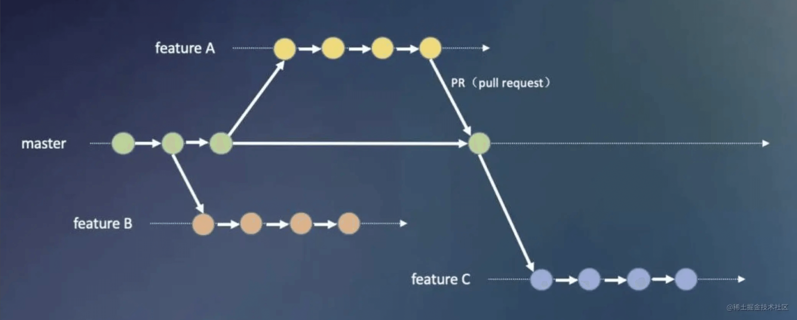
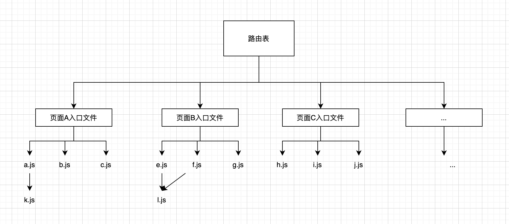

# 通过需求分支更改文件感知需求影响页面

通过页面的全埋点的实现，可以感知每个页面的 PV、页面内元素的点击，如果希望感知某迭代需求上线后，其影响页面的 PV、点击情况的变化应该怎么做呢？

一个办法是人力判别这个迭代需求所影响的页面，这样可以准确知道迭代需求与影响页面的关联。但是这种依靠人力判别的方法，在项目大量的迭代需求面前，是行不通的，而且效率非常低下，有没有办法能够实现自动关联呢？

这里提供一种通过需求分支文件 diff 自动获取迭代需求所关联页面的方法。本文示例代码[地址](https://github.com/fulldo/parse-page-file-map)。

## 实现思路

### 开发工作流与文件 diff

通常我们开发都是从 `master` 分支拉一个 `feature` 分支出来，等开发完成时，会再将 `feature` 分支合进 `master` 分支，如下图所示：



[图片来源](https://juejin.cn/post/7050012586296737805#heading-3)

而从 `feature` 分支合进 `master` 分支的这个 merge commit，是有一个文件 diff 列表的，通过这个 diff 我们就能知道这个需求分支所更改的文件了。

### 页面文件关系

在大型 `React` 应用中，一般有一个 `routes.js` 的文件定义路由表，通过 `loadable` 库做代码分割动态加载页面组件， `routes.js` 一般如这样：

```js
// routes.js
export const routes = [
  {
    path: "/user",
    load: () => import("./pages/user"),
  },
  {
    path: "/about",
    load: () => import("./pages/about"),
  },
];

// app.js
import { routes } from "./routes";
import Loadable from "react-loadable";

<Router>
  {routes.map((route) => {
    return (
      <Route
        exact
        path={route.path}
        component={Loadable({
          loader: route.load,
          loading: null,
        })}
      />
    );
  })}
</Router>;
```

`routes.js` 相当于定于了页面及其对应文件的入口，那么页面与文件之间有这样的一个依赖关系树：



一般来说，我们的项目都是形如上图的文件关系树，如果我们能分析出每个页面的入口文件以及其依赖文件，是不是就能知道每个页面所依赖的文件是什么了，即页面与文件的关系。

前面已经通过 diff 获取到了这个需求分支的更改文件，再结合上面得到的页面与文件的关系，这样通过映射，就可以获得这个需求分支所影响的页面了。

## 实现过程

### 获取分支 diff

首先我们获取到从 `feature` 分支合进 `master` 分支的这个 merge commit 的 diff 文件列表。

可以通过 git diff 命令获取到文件列表：

```bash
git diff --name-only HEAD~ HEAD
```

这里的意思是获取最近一个 commit 的 diff 文件名称，我们再将它封装成一个函数，就能通过 JavaScript 的形式调用的：

```js
function getGitDiffFiles() {
  const fileListString = require("child_process").execSync(
    `git diff --name-only HEAD~ HEAD`,
    {
      encoding: "utf8",
    }
  );
  if (!fileListString) return [];
  const result = fileListString.split("\n").filter(Boolean);
  return result;
}
```

在我们需求分支合进了 `master` 分支之后，这样我们就能获取到需求分支的文件 `diff` 了。

### 生成文件到页面的映射

要生成文件到页面的映射，首先我们要解析出上面路由表 `routes.js` 的 `path` 和 `load` ，即页面地址和入口文件路径。

这里有两个方法可以拿得到：

1. AST 静态解析。AST 静态解析这个文件从而获取到 `path` 和 `load`，但是有一个问题，如果 `path` 和 `load` 是通过变量形式定义的，就比较难解析：

```js
const PATH_USER = "/user";
const PATH_ABOUT = "/about";
export const routes = [
  {
    path: PATH_USER,
    load: () => import("./pages/user"),
  },
  {
    path: PATH_ABOUT,
    load: () => import("./pages/about"),
  },
];
```

2. 运行时解析。即在运行解析任务的时候，通过模块化的方式引入。

第一种方式不好处理，所以第二种方法会比较好，能规避变量形式定义的值，在运行时只能取到变量的值。

如果 `js` 文件，在 `nodejs` 端可以直接通过 `require` 引入：

```js
// parse.js
const { routes } = require("path/to/routes");
```

然后拿到 `path` 和 `load` 就可以直接取值了，而 `load` 是一个函数，可以调用 `toString` 函数之后正则匹配出入口文件路径，具体如下：

```js
// parse.js
const { routes } = require("path/to/routes");

console.log(routes[0].path, routes[0].load);

function getPathEntry(routes) {
  const result = {};
  routes.forEach((item) => {
    if (item.load) {
      const loadEntryPathMatched = item.load
        .toString()
        .match(/['"]\.(\/.+?)['"]/);
      const loadEntryPath = loadPathMatched ? loadPathMatched[1] : null;
      result[loadEntryPath] = item.path;
    }
  });
  return result;
}

console.log(getPathEntry(routes));

// ts-node parse.js
// 输出以下结果
// {
//      "/pages/user": "/user",
//      "/pages/about": "/about"
// }
```

如果路由表文件 `typescript` 的 `ts/tsx` 的 `routes.ts` 文件怎么办呢？`nodejs` 不能直接 `require` 这类文件，但我们可以通过 [ts-node](https://github.com/TypeStrong/ts-node) 来实现，`ts-node` 是一个可以在 `node` 端直接执行 `typescript` 文件的第三方库。

安装 `ts-node` ：

```bash
yarn add ts-node
```

然后再这样运行即可得到结果了：

```bash
yarn ts-node -O '{"module":"commonJS","esModuleInterop":true}' --files -r tsconfig-paths/register parse.js
```

这里解析下这些参数的含义：

```
-O, --compiler-options [opts] JSON object to merge with compiler options，即 typescript 的编译选项

{"module":"commonJS","esModuleInterop":true}，这里是以 nodejs 运行 js 文件，并且通过 require 的形式导入模块，所以要设置成 commonJS，esModuleInterop是兼容 commonjs 模块导入 esm 模块的一个选项设置，也需要设置为 true

--files 启动时从 tsconfig.json 加载 files, include 和 exclude

-r 在执行前引入一个 node 模块

tsconfig-paths/register 引入这个包是解决 tsconfig.json 定义的 path 的别名解析问题

```

拿到页面入口文件的路径之后，我们就可以从入口文件开始，解析出页面的文件依赖树了。这里利用了 [madge](https://github.com/pahen/madge) 这个库实现文件依赖的生成。下面简单讲解下这个库的实现原理。

解析出文件依赖树的具体步骤主要是一下步骤：

1. 收集解析当前文件的依赖文件，即通过 `import` 和 `require` 进来的的模块
2. 遍历依赖文件，继续执行步骤 1，直至无依赖文件
3. 将文件依赖树结构化（扁平处理），即生成文件到它依赖文件数组的映射

对于不同类型的文件，它们的 `AST` 是不相同的，所以有不同的解析依赖处理器：

```js
// 简化后
const detectiveCjs = require("detective-cjs");
const detectiveAmd = require("detective-amd");
const detectiveEs6 = require("detective-es6");
const detectiveLess = require("detective-less");
const detectivePostcss = require("detective-postcss");
const detectiveSass = require("detective-sass");
const detectiveScss = require("detective-scss");
const detectiveStylus = require("detective-stylus");
const detectiveTypeScript = require("detective-typescript");

function precinct(content, options = {}) {
  let { type } = options;
  // 根据不同类型，使用不同的类型解析器，解析器依赖文件
  let theDetective;
  switch (type) {
    case "commonjs":
      theDetective = mixedMode ? detectiveEs6Cjs : detectiveCjs;
      break;
    case "css":
      theDetective = detectivePostcss;
      break;
    case "amd":
      theDetective = detectiveAmd;
      break;
    case "es6":
      theDetective = mixedMode ? detectiveEs6Cjs : detectiveEs6;
      break;
    case "sass":
      theDetective = detectiveSass;
      break;
    case "less":
      theDetective = detectiveLess;
      break;
    case "scss":
      theDetective = detectiveScss;
      break;
    case "stylus":
      theDetective = detectiveStylus;
      break;
    case "ts":
      theDetective = detectiveTypeScript;
      break;
    case "tsx":
      theDetective = detectiveTypeScript.tsx;
      break;
  }

  dependencies = theDetective(ast, options[type]);

  return dependencies;
}
```

这里再以 `tsx` 文件为例，即上面的 `detectiveTypeScript`，讲述下其如何解析依赖的。

`detectiveTypeScript` 通过 [node-source-walk](https://github.com/mrjoelkemp/node-source-walk) 遍历 `tsx` 文件的 `AST`，然后判断不同
的 `node.type` 做处理获取引入的模块：

```js
const Walker = require("node-source-walk");

const walker = new Walker(walkerOptions);

const dependencies = [];

walker.walk(src, function (node) {
  switch (node.type) {
    case "ImportExpression":
      if (!options.skipAsyncImports && node.source && node.source.value) {
        dependencies.push(node.source.value);
      }
      break;
    case "ImportDeclaration": // 形如 import xxx from './xx/yy'
      if (skipTypeImports && node.importKind == "type") {
        break;
      }
      if (node.source && node.source.value) {
        dependencies.push(node.source.value); // 获取得到的就是 './xx/yy'
      }
      break;
    case "ExportNamedDeclaration":
    case "ExportAllDeclaration":
      if (node.source && node.source.value) {
        dependencies.push(node.source.value);
      }
      break;
    case "TSExternalModuleReference":
      if (node.expression && node.expression.value) {
        dependencies.push(node.expression.value);
      }
      break;
    case "TSImportType":
      if (!skipTypeImports && node.parameter.type === "TSLiteralType") {
        dependencies.push(node.parameter.literal.value);
      }
      break;
    case "CallExpression": // 形如 require： require('./xx/yy')
      if (
        !mixedImports ||
        !types.isRequire(node) ||
        !node.arguments ||
        !node.arguments.length
      ) {
        break;
      }

      if (types.isPlainRequire(node)) {
        const result = extractDependencyFromRequire(node);
        if (result) {
          dependencies.push(result); // 获取得到的就是 './xx/yy'
        }
      } else if (types.isMainScopedRequire(node)) {
        dependencies.push(extractDependencyFromMainRequire(node));
      }

      break;
    default:
      return;
  }
});

return dependencies;
```

获得文件的依赖列表后，就会遍历该列表，然后利用 [cabinet](https://github.com/OptimalBits/cabinet) 获取文件的全路径：

```js
// 简化后
let dependencies = precinct.paperwork(config.filename, precinctOptions);
// 获取文件全路径
for (let i = 0, l = dependencies.length; i < l; i++) {
  const dep = dependencies[i];
  const result = cabinet({
    partial: dep,
    filename: config.filename,
    directory: config.directory,
    ast: precinct.ast,
    config: config.requireConfig,
    webpackConfig: config.webpackConfig,
    nodeModulesConfig: config.nodeModulesConfig,
    tsConfig: config.tsConfig,
  });
  resolvedDependencies.push(result);
}

return resolvedDependencies;
```

然后递归此过程，即可获得某个页面入口文件的依赖文件树了，然后经过 `madge` 处理后，我们会得到一个形如这样的映射：

```js
{
  '/user': [
    'src/common/x.js', // 假设是公共文件
    'src/pages/user/a.js',
    'src/pages/user/b.js',
    'src/pages/user/dir/c.js',
    'src/pages/user/index.js'
  ],
  '/about': [
    'src/common/x.js', // 假设是公共文件
    'src/pages/about/d.js',
    'src/pages/about/e.js',
    'src/pages/about/index.js'
  ]
}
```

然后结合入口文件到页面 `path` 的映射，我们再处理一下，就能得到文件到到页面的映射：

```js
// 之前已有：
{
   "/pages/user": "/user",
   "/pages/about": "/about"
}

// 再处理后：
{
  'src/common/x.js': [ '/user', '/about' ],
  'src/pages/user/a.js': [ '/user' ],
  'src/pages/user/b.js': [ '/user' ],
  'src/pages/user/dir/c.js': [ '/user' ],
  'src/pages/user/index.js': [ '/user' ],
  'src/pages/about/d.js': [ '/about' ],
  'src/pages/about/e.js': [ '/about' ],
  'src/pages/about/index.js': [ '/about' ]
}
```

最后结合 `diff` 获取得到需求分支更改的文件列表，就能根据上表映射出这个需求影响的页面了。

### 解析程序的运行

如果用的是 `gitlab`，解析程序的运行可以通过 `CI/CD` 流程去自动执行。

可以通过编写 `.gitlab-ci.yml` 文件，新建一个 `parse` 的流程去运行，参考例子如下：

```
stages:
  - parse

before_script:
  - yarn

parse:
  image: 流程需要的镜像
  stage: parse
  script:
    - yarn ts-node -O '{"module":"commonJS","esModuleInterop":true}' --files -r tsconfig-paths/register parse.js
```

当然，这个是自动化的流程，也可以用其他方法运行，具体情况具体分析。

## 总结

要实现自动获得迭代需求影响的页面，有以下三个步骤：

1. 在需求 `feature` 分支 `merge` 进 `master` 分支时，通过 `CI/CD` 流程跑解析程序
2. 解析程序中通过 `git diff` 获取到这次 `merge` 更改的文件
3. 解析程序生成文件到页面的映射
4. 通过更改文件列表获取到需求影响的页面

经过上面的折腾，我们就能获得某个迭代需求影响的页面，然后结合之前通过全埋点获得的页面的 PV、页面元素点击量，我们就能知道某个需求上线后，对某些页面的影响程度，从而得知这个需求的质量如何。
